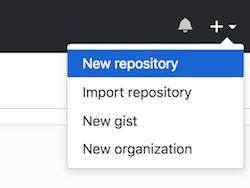

## Introduction

Version control software provides a systematic way to keep track of changes made to files. There are a number of version control software (VCS) systems ... Git is one of them. It's a powerful tool for tracking and reconciling changes to text files from individual or multiple contributors. The basic unit of Git is the repository. Unlike some other VCS, Git tracks changes by storing **snapshots** of entire repository at different points in time. This is internally different than "delta-based" system that just keeps track of changes to the files (https://git-scm.com/book/en/v2/Getting-Started-Git-Basics). While Git can be used as a standalone piece of software, many people leverage web hosting platforms that expand the VCS functionality and have project management and collaborative features built in. Several examples of these services include [Bitbucket](https://bitbucket.org/), [GitLab](https://about.gitlab.com/) and [GitHub](https://github.com/).

## GitHub

As we mentioned in the introduction, GitHub is a web-based platform for hosting Git repositories. The platform includes a web interface to explore files and perform version control operations, as well as a number of collaboration tools for commenting, opening requests for new features, using project management methods, social networking, creating versions of software releases, and many more. GitHub is an extremely popular service, particularly among software developers and scientists who want to share code as part of "open source" projects.

### 1. Log into github.com

To begin with we'll log into [github.com](https://github.com/)

If you haven't already created an account, make sure you follow the steps to do so.

### 2. Click the `+` icon and select "New repository"



### 3. Give the repository a name

Like the prompt suggests, repository names should be short and memorable. And they must be unique to your account ... i.e. you can't have two repositories in your account with the same name.


### 4. Check the box to "Initialize this repository with a README"

New repositories on GitHub require contents to initialize. To get started, we can initialize with a README file, which are typically included in repositories to provide a description of content, usage and / or any necessary software setup.


### 5. Create a new file

GitHub provides a file editor in the browser. We're going to make use of that here to demonstrate some of the basic concepts of version control ... but **nb** that editing files this way is not a typical workflow, especially if you're storing versions of your code locally (on your computer) and remotely (on GitHub). More on that later ...

```
#!/bin/bash

d=$(date '+%H:%M:%S');
printf "$d\n"
```

### 6. Edit the file

```
#!/bin/bash

d=$(date '+%H:%M:%S');
printf "the time is ...\n$d\n"
```

### 7. Take a look at the commit history and branch explorer


Each change to the repository (or **commit**) is recorded and tracked separately via a unique combination of characters. This **hash** is abbreviated in the commit history view, which provides an interface to explore the file(s) and line(s) that were changed as part of the commit.

GitHub also provides a view of **branches**, which you can think of as a collection of commits that can represent an entirely different version of the repository. Ultimately, you can perform a **merge** operation to combine changes across branches. This can be particularly helpful for collaborations between multiple individuals or for a single developer who would like to keep the "experimental" features separate from stable code. 

---

As mentioned above, the fundamental unit of Git is the **repository**. The steps we've completed up until now have introduced the basics of creating, committing and tracking changes within a single repository. However, GitHub allows its users to have multiple repositories. In some cases, rather than creating a repository from scratch you might need to **fork** another user's repository. This workflow can be useful for collaborative projects, as it essentially copies the contents and complete version control history at a single point in time.

### 8. Fork a repository

To illustrate the idea of **forking**, we'll need to start with an existing repository. For this exercise, we've created a repository that will include a comma separated value (.csv) file with data on our favorite foods. 

Each of us will fork this original repository ... and in doing so create new repositories with all of the files and previous changes in our accounts. 

Navigate to https://github.com/uvasomrc/foods and click the `Fork` button in the upper right-hand corner of the page.


### 9. Make a unique change to an existing file

Find the line with your initials in foods.csv, and after the comma enter your favorite food. If you don't find your initials in the list, feel free to add a new line with your initials and favorite food separated by a comma.

### 10. Submit a Pull Request

The **pull request** mechanism allows contributors to propose changes to the owner of the **upstream** repository. That owner can review these changes, and conditionally accept or reject them. This process may involve ongoing dialogue and review, during which time the proposed changes can be updated by editing the forked repository.

## Git (Command Line Interface)

https://help.github.com/articles/generating-a-new-ssh-key-and-adding-it-to-the-ssh-agent/#platform-mac

```
git config -l
```

## References


